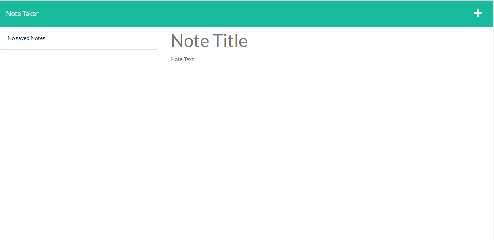

# Note-Taker

  
  
## [Description](#table-of-contents)

Creating an application called, Note Taker, by modifying a started code which will be use to write and save notes. This application will use an Express.js back end and will save and retrieve note data from a JSON file.
    
## [Table of Contents](#table-of-contents)

- [Description](#description)
- [Installation](#installation)
- [Usage](#usage)
- [Contributing](#contributing)
- [Test](#test)
- [License](#license)
- [Questions](#questions)

## [Installation](#table-of-contents)
    
To install this application, clone the repository's code, open it in VS Code, open the terminal of your preference,  and run the following command: "node server.js"

## [Usage](#table-of-contents)
    
Click the + button on top right of the webpage to create a new note. Enter a title for your note, then write your note in the body, and press the save button. The new note will be showed in the left column of the webpage. To delete a note, press the red trash can next to the note.

To try or use the application, please follow the next link: 

The following images show how the web application will look like:

  ## [Contributing](#table-of-contents)

  Thanks! But I am not accepting foreign contributions at the moment.

## [Test](#table-of-contents)

N/A

## [License](#table-of-contents)

    Copyright (C) 2023 Cristhian Bustamante

   Permission is hereby granted, free of charge, to any person obtaining a copy of this software and associated documentation files (the "Software"), to deal in the Software without restriction, including without limitation the rights to use, copy, modify, merge, publish, distribute, sublicense, and/or sell copies of the Software, and to permit persons to whom the Software is furnished to do so, subject to the following conditions:

   The above copyright notice and this permission notice shall be included in all copies or substantial portions of the Software.

   THE SOFTWARE IS PROVIDED "AS IS", WITHOUT WARRANTY OF ANY KIND, EXPRESS OR IMPLIED, INCLUDING BUT NOT LIMITED TO THE WARRANTIES OF MERCHANTABILITY, FITNESS FOR A PARTICULAR PURPOSE AND NONINFRINGEMENT. IN NO EVENT SHALL THE AUTHORS OR COPYRIGHT HOLDERS BE LIABLE FOR ANY CLAIM, DAMAGES OR OTHER LIABILITY, WHETHER IN AN ACTION OF CONTRACT, TORT OR OTHERWISE, ARISING FROM, OUT OF OR IN CONNECTION WITH THE SOFTWARE OR THE USE OR OTHER DEALINGS IN THE SOFTWARE.       
   
   https://opensource.org/licenses/MIT
        
## [Questions](#table-of-contents)

- You can reach me through https://github.com/Luffykun20
- Also, you can contact me through my e-mail: [cristhian_georgia_20@hotmail.com](mailto:cristhian_georgia_20@hotmail.com) if you have any question.
